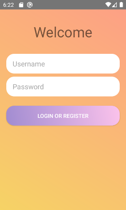
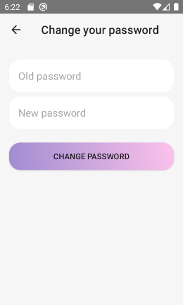

# messenger-android

Мобильный мессенден в связке с [сервером](https://github.com/vettich/messenger-server) на GraphQL

## Основные возможности

- [x] Авторизация/Регистрация
- [x] Смена пароля пользователя
- [x] Список чатов пользователя
- [ ] Автообновление списка чатов (сейчас нужно выйти и зайти в приложение снова)
- [x] Создание нового чата с пользователем
- [x] Список сообщений
- [x] Отслеживание сообщений в реальном времени
- [x] Отправка сообщения в чат
- [ ] Уведомление о новом сообщении
- [ ] Список не прочитанных сообщений

## Скриншоты

| Страница авторизации/регистрации | Смена пароля |
| --- | --- |
|  |  |
