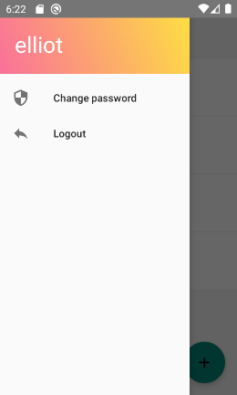
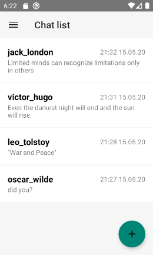
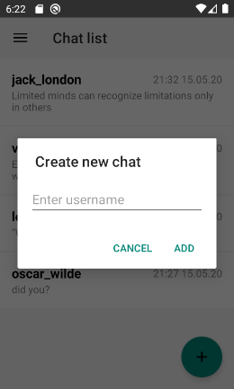
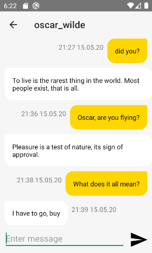

# messenger-android

Мобильный мессенджер в связке с [сервером на GraphQL](https://github.com/vettich/messenger-server)

## Основные возможности

- [x] Авторизация/Регистрация
- [x] Смена пароля пользователя
- [x] Список чатов пользователя
- [x] Автообновление списка чатов
- [x] Создание нового чата с пользователем
- [x] Список сообщений
- [x] Отслеживание сообщений в реальном времени
- [x] Отправка сообщения в чат
- [ ] Уведомление о новом сообщении
- [ ] Список не прочитанных сообщений

## Скриншоты

Авторизация/регистрация | Меню | Смена пароля
--- | --- | ---
 |  | 

Список чатов | Добавление чата | Список сообщений
--- | --- | ---
 |  | 
